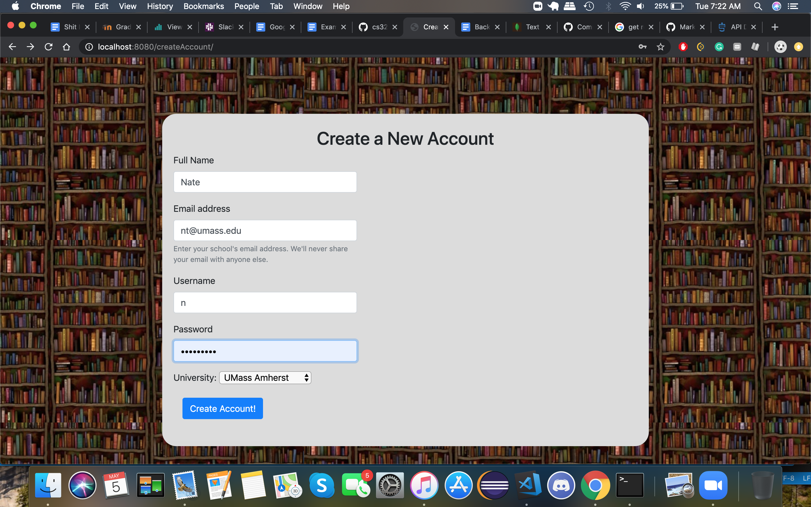
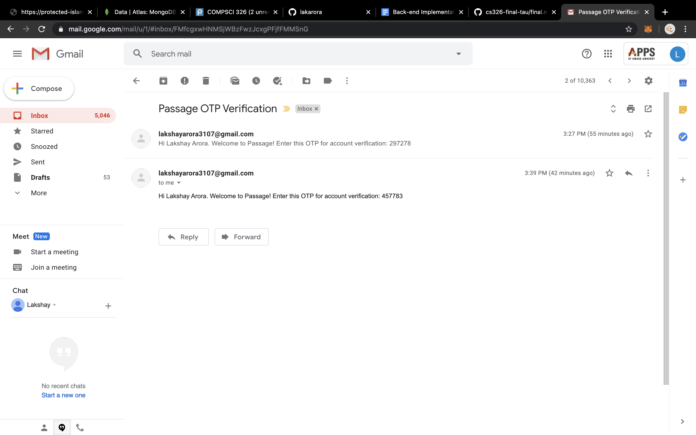
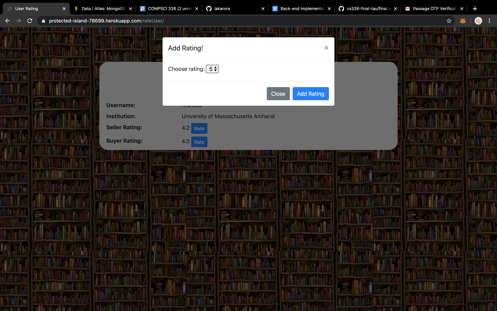
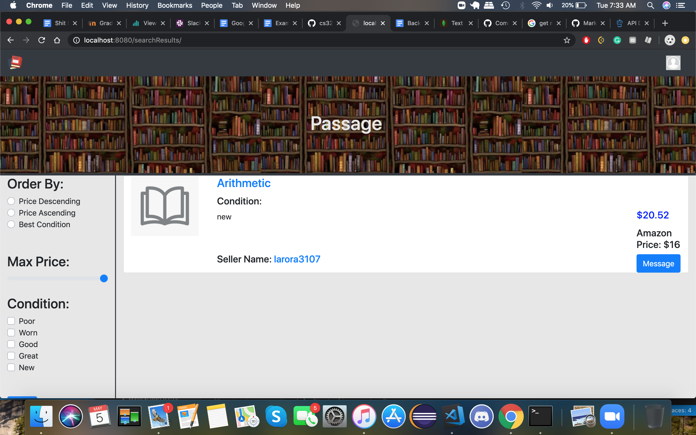
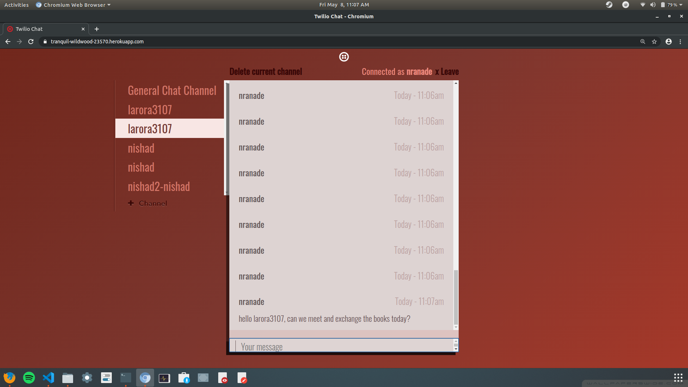

## Title: Tau

## Application Name: Passage
 https://protected-island-78699.herokuapp.com/
## Semester: Spring 2020

## Overview
Passage is a web-based application that students in any of the Five Colleges can use to pass on course textbooks (or other books) to other students in the area. The website is similar to Craigslist, but verifies that the sellers and buyers are indeed students at one of the Five Colleges, and also provides an in-app messaging feature for greater convenience and confidentiality. Potential buyers can message sellers through the app, and arrange to meet up and exchange the books and payments. The application will also incorporate a rating system where the users can rate each other based on their transaction satisfaction. Users can also compare the books on the website to those on Amazon so that they know if they are getting a deal.
## Team Members
* Lakshay Arora - [lakarora](https://github.com/lakarora)
* Nishad Ranade - [nishadranade](https://github.com/nishadranade) 
* Nathan Grant - [N8Grant](https://github.com/N8Grant)

## User Interface
 HTML        | Description          |
| ------------- |:-------------:|
| accountInfo.html | Displays your account information |
| createAccount.html | Form with input to create a new account |
| findUserToRate.html | Search bar for username to rate another user |
| index.html | Home page where you can log in |
| messages.html | Messages page where you contact other users |
| myPostings.html | Page for all of your current postings |
| searchBook.html | Page for inputting title of book to search |
| searchResults.html | Page for displaying relevent books |
| sellBook.html | Enter in book informaiton to sell |
| setPrice.html | Compare price with amazon and enter in price |
| userRating.html | Dislplays user information |
| verifyOTP.html | Input the otp which was sent through email |

Home Page:

Login:

Create Account:

OTP sent via email:

User Options:

User Profile:

Rate Other Users:

Search Book:

Search Results:

Messaging App:

## APIs

* localhost:8080/findUser/ - Used to route and get data from database to then display to the user ratings page, need to be logged in

| Parameter        | Description          |
| ------------- |:-------------:|
| username     | (Required) Username of person to rate |

| Key        | Value         | Description |
| ------------- |:-------------:|----------|
| result | String | Returns wether or not the query was successful|
| username | String    |  Username of person |
| institution   | String | College name of person |
| sellerRating    | number | Seller rating of person |
| buyerRating    | number | Buyer rating of person|
| numBuyerRatings   | number | Number of buyer ratings of person |
| numSellerRatings   | number | Number of seller ratings of person|

* localhost:8080/userRating/ - Used to fetch data from the database about the searched users informaion

| Parameter        | Description          |
| ------------- |:-------------:|
| email     | (Required) Username of person to create account |
| username     | (Required) Username of person to create account |
| fullName     | (Required) Username of person to create account |

| Key        | Value         | Description |
| ------------- |:-------------:|----------|
| result | String | Returns wether or not the creation was successful |

* localhost:8080/accountInfo/ - Displays your accounts information such as username, instution, seller rating, and buyer rating

| Parameter        | Description          |
| ------------- |:-------------:|
| username     | (Required) Username of person to retreive account info |

| Key        | Value         | Description |
| ------------- |:-------------:|----------|
| result | String | Returns wether or not the query was successful|
| username | String    |  Username of person |
| fullName    | String | Full name of person |
| institution   | String | College name of person |
| sRating    | number | Seller rating of person |
| bRating    | number | Buyer rating of person|
* localhost:8080/checkNewAccount/ - Used to check if a created account alread exists

| Parameter        | Description          |
| ------------- |:-------------:|
| email     | (Required) Username of person to create account |
| username     | (Required) Username of person to create account |
| fullName     | (Required) Username of person to create account |

| Key        | Value         | Description |
| ------------- |:-------------:|----------|
| result | String | Returns wether or not the creation was successful |
| OTP | String | Returns a OTP that the user has to enter to authenticate themselves|
* localhost:8080/MyPostings/ - Used to display the users current postings, need to be logged in to use

| Parameter        | Description          |
| ------------- |:-------------:|
| username     | (Required) Username of person to retreive postings |

| Key        | Value         | Description |
| ------------- |:-------------:|----------|
| result | String | Returns wether or not the query was successful|
| postings | Array | Returns all of the users posts |
* localhost:8080/setPrice/ - Page to set price of a new listing, displays amazon price, need to be logged in to use

| Parameter        | Description          |
| ------------- |:-------------:|
| title      | (Required) The title of the book to get scraped on Amazon |

| Key        | Value         | Description |
| ------------- |:-------------:|----------|
| price | number | Returns the price of the book on Amazon|
* localhost:8080/postBook/ - Page to enter in book information to be posted, need to be logged in to use

| Parameter        | Description          |
| ------------- |:-------------:|
| body      | (Required) The book information to be added to the server |

| Key        | Value         | Description |
| ------------- |:-------------:|----------|
| result | String | Returns wether or not the book was added to the database|

* localhost:8080/searchBook/ - Post request to retreive book data from the database

| Parameter        | Description          |
| ------------- |:-------------:|
| query      | (Required) The search query that is to be used on the database to find books|

| Key        | Value         | Description |
| ------------- |:-------------:|----------|
| result | String | Returns wether or not the query was successful|
| searchResults | Array | Returns array of books that matched search query |             

## Database
There are two database collections used for Passage implemented in mongoDB. 
1. Collection for User Information
    
    userInformation {

        name: String,  // Name of the user
        email: String, // Email of the user
        password: String, // Password of the user
        institution: String, // College that the user attends
        username: String,  // Chosen Username
        buyerRating: number,  // The users buyer rating
        sellerRating: number,  // The users seller rating
        numBuyerRatings: number,  // The number of buyer ratings on user
        numSellerRatings: number  // The number of seller ratings on user

    }
    
2. Collection for Book Postings

    bookPostings {
        
        _id: ObjectId,
        username: String,   // User who posted book
        title: String, // Title of the book
        author: String ,    // Author(s) of the book
        isbn: String ,      // ISBN of the book
        condition: String,  // Condition that the book is in
        institution: String     // University that the book was used at
        subject: String,  // Course subject of the book
        courseNumber: String,   // Course number that the book is used for
        price: float,   // Price of the book 
        amazonPrice: float,  // Price of the book on amazon      
        
    }

## URL Routes/Mappings
* /options/ - Page after successful login, need to be logged in or else you will be returned to the main page
* /createAccount/ - Page accessed from index.html, used to create an account, no permissions needed
* /messages/ - Dashboard for your message feeds, need to be logged in to access it
* /sell/ - Page for creating a book posting, need to be signed in to use it. Can be accessed from options
* /findUser/ - Used to route and get data from database to then display to the user ratings page, need to be logged in
* /rate/ - Used to search a user to rate, need to be logged in to use
* /userRating/ - Used to fetch data from the database about the searched users informaion
* /accountInfo/ - Displays your accounts information such as username, instution, seller rating, and buyer rating
* /checkNewAccount/ - Used to check if a created account alread exists
* /verifyAccount/ - Used to enter in the OTP sent to the new users email
* /MyPostings/ - Used to display the users current postings, need to be logged in to use
* /setPrice/ - Page to set price of a new listing, displays amazon price, need to be logged in to use
* /postBook/ - Page to enter in book information to be posted, need to be logged in to use
* /rateUser/ - Displays username, instution, seller rating, and buyer rating of the searched person. Need to be logged in to use
* /search/ - Displays a search bar to search books by their title
* /searchBook/ - Post request to retreive book data from the database
* /searchResults/ - Displays all of the books from the search query
## Authentication/Authorization
Users are required to register with their school emails and upon creation of a new account, an OTP is sent to their email for verification. Users login with their credentials and cookies are setup and access the rest of the website. If they are not logged in, the website redirects them to the home page using cookie checks. 

## Division of Labor
* Lakshay Arora - Developed the front-end for new account creation page, account verification using OTP, page for displaying options after a successful login, search users for rating them and rating other users via a popup. Implemented several dummy request-response handlers for Milestone-2 to test the client side code. Set up browser cookies to ensure that a user is logged in before accessing any of the other APIs. Set up the Mongo DB Atlas cluster with two collections for user information and book postings. Set up environment variables on Heroku and modified the code for checking the existence of a secrets.json file or the variables. Implemented the back-end code for login and signup functionality with account verification using OTP (email sent using nodemailer, google apis, and xoauth2). Also added the server-side implementation for rating other users. Databse operations implemented: get, put and update. 

* Nishad Ranade- Wrote the front-end for the Account Information page, the Options page, the Sell Book (posting a book to the website), as well as parts of the Search Book and other pages. Implemented multiple dummy request-response handlers for Milestone-2, and followed up in Milestone-3 by implementing part of the database, specifically a "getMany" (aka find() in Mongo) query, as well as a delete query that can be used to delete multiple book postings at once. Implemented the server-side code for Options, Sell Book, Account Info and My Postings with the necessary database queries. Used the Twilio Chat Rest API to create the independently hosted chat application, where users can create separate channels and send messages to each other.

* Nathan Grant - Created the home page aka. index.html and searchResults.html for displaying relavent books. Also created the messages.html for users to communicate and included a menu list for navigating all of the different user options. Did the search book page and set it up with a request-response model where the server takes the search query and returns (currently fake) search results. He also did the Rate User page in which the rating is passed to the server and a confirmation is returned. After accepting you are returned to the Options page. Made Flask app for scraping Amazon prices and hosted it on Heroku. Also implemented the jQuery to request the server for prices. Implemented database interaction for searching books.
## Conclusion
Given the online setting, it was a bit more challenging putting together a large project like this. Overall we all learned a great deal about the fundamentals of creating and deploying a fully functioning website. One difficulty was when we all had to work on the server routing file at once, but we made sure we were working on separate functions, and managed to merge without big issues. We all learned valuable skills at each part of the development phase. We would have liked better guidance on GitHub collaboration and deployment, and would have preferred if we had started the project a few weeks earlier in the schedule. 
