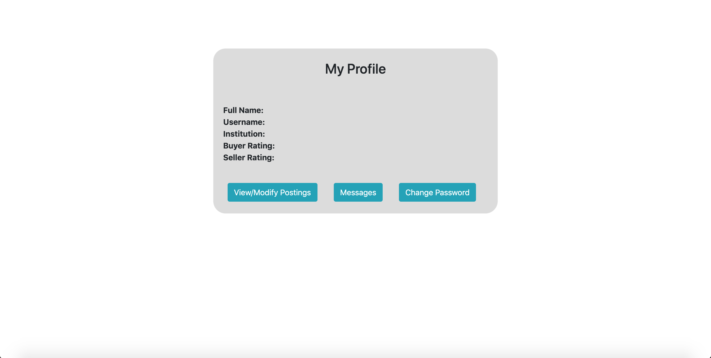

# API Flow Diagram

# Client Interface  

  
This page demonstrates the workings of the search book functionality. After a user searches for a book they will be sent to this page where they can look through all of the books relevant to the query in the database. They can also filter through the results with the options on the side.  
  
  
This page now has the skeleton for logging into the webpage. The website also uses cookies to track who is the user logged into passage. After a successful login, the account username is stored to other pages so that the database knows which user is accessing the data after the login screen.  
  

  
This page includes inputs for users looking to sell a new book. They can input all of the book data and then send it off to the server to be added to the book database. Afterward, the book will also be added to the user's books for the sale page.  

  
This page is the central hub for account activity. Using the cookie data about the username, the page will be populated with the user's information gathered from the database. To access this page however you must be logged in.  
  

This page allows you to rate a user which you have traded a book with. It allows you to specify which type of rating you wish to give the user based off of which end of the deal you are on. After finding the user which you want to rate you then chose wether you want to rate theor seller rating or their buyer rating. A popup will then appear which details which values 1-5 you wish to rate the transaction, and then you can rate the user and the data is sent to the sever.

# Application URL  

[Passage on Heroku](URL)  
  

# Work Breakdown  

For this milestone the work had been divided as such:  

- Lakshay Arora - Login, Sign Up and OTP  
- Nishad Ranade - Sell Book, My Profile
- Nathan Grant - Search book, User Ratings  
  

**Lakshay** set up the base server and modules, and did the Login as well and Sign Up APIs, with email address verification done with an OTP. Also set up a dummy request-response model that will check availability for username, email address, and will ensure that the OTP entered for verification matches the one sent to the email address. Also set up browser cookies to ensure that a user is logged before accessing any of the other APIs.

 
**Nishad** started with the Options page, and then implemented the My Profile with a dummy request-response handler, which grabs your own information from the database. Also did the Sell Book page, where a user can input book details, make a request to the server to get the Amazon Used Price for the book through a scraper, decide the price of the posted book based on that, and then post the book for sale.

**Nathan** did the search book page and set it up with a request-response model where the server takes the search query and returns (currently fake) search results. He also did the Rate User page in which the rating is passed to the server and a confirmation is returned. After accepting you are returned to the Options page.
Lakshay started by creating the server files and making a skeleton for the login and sign up functionalities. He then set up the routing for the account options page and set up browser cookies for the username. Nishade implemented the profile page with a dummy request-response handler. He also implemented the javascript for the select action page, used after you log in. Nathan did the search book page and set it up so that the server just returns a dummy response variable. He also did the rate user page in which the rating is passed to the server and a confirmation is returned. After accepting you are returned to the options page.
